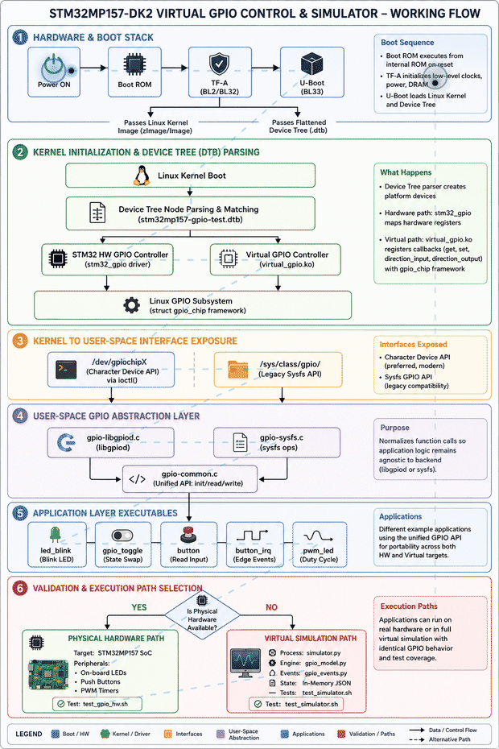

# STM32MP157-DK2 — Virtual GPIO Control & Simulator

[](#build-procedure)
[](#hardware-platform)
[](#hardware-platform)
[](#software-architecture)
[](#yocto-build)
[](#project-structure)
[](#gpio-interfaces)
[](#license)

---

## Complete STM32MP157-DK2 System Flow

The following animation illustrates the complete STM32MP157-DK2 execution flow, from power-on and bootloader initialization through Linux kernel, Device Tree, peripheral drivers, middleware, and the user application.

<p align="center">
  
</p>

---

## Table of Contents

1. [Project Overview](#1-project-overview)
2. [Project Objectives](#2-project-objectives)
3. [Hardware Platform](#3-hardware-platform)
4. [Hardware Architecture](#4-hardware-architecture)
5. [Software Architecture](#5-software-architecture)
6. [Complete System Flow](#6-complete-system-flow)
7. [Boot Flow](#7-boot-flow)
8. [GPIO Software Flow](#8-gpio-software-flow)
9. [Linux GPIO Subsystem](#9-linux-gpio-subsystem)
10. [Virtual GPIO Driver](#10-virtual-gpio-driver)
11. [Device Tree Flow](#11-device-tree-flow)
12. [libgpiod Flow](#12-libgpiod-flow)
13. [Sysfs GPIO Flow](#13-sysfs-gpio-flow)
14. [Application Flow](#14-application-flow)
15. [Simulator Flow](#15-simulator-flow)
16. [Project Directory Structure](#16-project-directory-structure)
17. [Source Code Organization](#17-source-code-organization)
18. [Kernel Driver](#18-kernel-driver)
19. [Yocto Layer](#19-yocto-layer)
20. [Prerequisites](#20-prerequisites)
21. [Repository Setup](#21-repository-setup)
22. [Native Build](#22-native-build)
23. [Yocto Build](#23-yocto-build)
24. [Build Procedure](#24-build-procedure)
25. [SD Card Preparation](#25-sd-card-preparation)
26. [Flashing Procedure](#26-flashing-procedure)
27. [Booting STM32MP157-DK2](#27-booting-stm32mp157-dk2)
28. [GPIO Testing](#28-gpio-testing)
29. [LED Testing](#29-led-testing)
30. [Button Testing](#30-button-testing)
31. [Interrupt Testing](#31-interrupt-testing)
32. [PWM Testing](#32-pwm-testing)
33. [Simulator Testing](#33-simulator-testing)
34. [Unit Testing](#34-unit-testing)
35. [Integration Testing](#35-integration-testing)
36. [Debugging](#36-debugging)
37. [Troubleshooting](#37-troubleshooting)
38. [Development Workflow](#38-development-workflow)
39. [Adding a New GPIO](#39-adding-a-new-gpio)
40. [Adding a New Application](#40-adding-a-new-application)
41. [Adding a New Device Tree Node](#41-adding-a-new-device-tree-node)
42. [Adding a New Yocto Recipe](#42-adding-a-new-yocto-recipe)
43. [Cleaning the Build](#43-cleaning-the-build)
44. [Project Deliverables](#44-project-deliverables)
45. [Future Enhancements](#45-future-enhancements)
46. [License](#46-license)

---

# 1. Project Overview

The **STM32MP157-DK2 Virtual GPIO Control & Simulator** project demonstrates complete GPIO development on an embedded Linux platform using the **STM32MP157-DK2 development board**.

The project covers the complete path from:

```text
Hardware
   ↓
STM32MP157 SoC
   ↓
Boot ROM
   ↓
TF-A / U-Boot
   ↓
Linux Kernel
   ↓
Device Tree
   ↓
Linux GPIO Subsystem
   ↓
Virtual GPIO Driver
   ↓
GPIO Character Device
   ↓
libgpiod / Sysfs
   ↓
C Applications
   ↓
LED / Button / Interrupt / PWM
```

A software GPIO simulator is also provided so GPIO applications can be developed and tested without physical hardware.

---

# 2. Project Objectives

The main objectives are:

* Understand STM32MP157 Linux boot flow.
* Understand Device Tree configuration.
* Understand Linux GPIO subsystem.
* Develop a virtual GPIO kernel driver.
* Expose GPIO through the Linux GPIO framework.
* Access GPIO using `libgpiod`.
* Demonstrate legacy Sysfs GPIO access.
* Develop LED applications.
* Develop button applications.
* Implement GPIO interrupt handling.
* Implement PWM LED control.
* Provide a GPIO simulator.
* Automate build and deployment using Yocto.
* Automate hardware and software testing.
* Provide a complete embedded Linux development workflow.

---

# 3. Hardware Platform

## STM32MP157-DK2

The STM32MP157-DK2 is based on the STM32MP157 MPU family.

The processor contains:

```text
STM32MP157
│
├── Cortex-A7 CPU
│   └── Linux
│
├── Cortex-M4 CPU
│   └── Real-time applications
│
├── DDR Memory
│
├── GPIO Controllers
│
├── I2C
├── SPI
├── UART
├── ADC
├── PWM
├── Ethernet
├── USB
├── SDMMC
├── MIPI DSI
└── Camera / Display interfaces
```

For this project, the primary focus is:

```text
STM32MP157
      │
      └── GPIO
           │
           ├── LED
           ├── Button
           ├── Interrupt
           └── PWM
```

---

# 4. Hardware Architecture

```text
             STM32MP157-DK2
                    │
          ┌─────────┴─────────┐
          │                   │
      Cortex-A7            Cortex-M4
          │
        Linux
          │
   ┌──────┴───────┐
   │              │
 GPIO Controller  Other HW
   │
   ├── GPIO pins
   ├── LED
   ├── Button
   └── PWM
```

The Cortex-A7 Linux environment is responsible for the GPIO application and Linux driver side of this project.

---

# 5. Software Architecture

```text
+------------------------------------------------------+
|                    Applications                      |
|                                                      |
| LED | Button | Interrupt | PWM | GPIO Test          |
+---------------------------+--------------------------+
                            |
                            v
+------------------------------------------------------+
|                  GPIO User Interface                 |
|                                                      |
|              libgpiod / Sysfs                       |
+---------------------------+--------------------------+
                            |
                            v
+------------------------------------------------------+
|                 Linux GPIO Subsystem                 |
|                                                      |
|                 gpio_chip framework                  |
+---------------------------+--------------------------+
                            |
                            v
+------------------------------------------------------+
|                Virtual GPIO Driver                   |
|                                                      |
|              virtual_gpio.ko                        |
+---------------------------+--------------------------+
                            |
                            v
+------------------------------------------------------+
|                   Linux Kernel                       |
+---------------------------+--------------------------+
                            |
                            v
+------------------------------------------------------+
|                STM32MP157 Hardware                   |
+------------------------------------------------------+
```

---

# 6. Complete System Flow

The complete project flow is:

```text
Power ON
   ↓
Boot ROM
   ↓
TF-A
   ↓
U-Boot
   ↓
Load Linux Kernel
   ↓
Load Device Tree
   ↓
Kernel Initialization
   ↓
GPIO Controller Initialization
   ↓
Virtual GPIO Driver
   ↓
gpiochip registration
   ↓
/dev/gpiochipX
   ↓
libgpiod
   ↓
Application
   ↓
GPIO Operation
```

For a real hardware GPIO:

```text
Application
    ↓
libgpiod
    ↓
/dev/gpiochipX
    ↓
Linux GPIO subsystem
    ↓
STM32 GPIO driver
    ↓
STM32 GPIO controller
    ↓
Physical GPIO pin
    ↓
LED / Button
```

For virtual GPIO:

```text
Application
    ↓
libgpiod
    ↓
/dev/gpiochipX
    ↓
Linux GPIO subsystem
    ↓
virtual_gpio.ko
    ↓
Software GPIO state
```

---

# 7. Boot Flow

```text
1. Power ON
      ↓
2. STM32 Boot ROM
      ↓
3. TF-A / Trusted Firmware-A
      ↓
4. U-Boot
      ↓
5. U-Boot initializes DDR
      ↓
6. U-Boot initializes storage
      ↓
7. U-Boot loads Kernel
      ↓
8. U-Boot loads Device Tree
      ↓
9. Linux Kernel starts
      ↓
10. Kernel decompresses / initializes
      ↓
11. Device Tree parsed
      ↓
12. Drivers initialized
      ↓
13. GPIO controller registered
      ↓
14. Root filesystem mounted
      ↓
15. systemd / init starts
      ↓
16. GPIO application available
```

---

# 8. GPIO Software Flow

For example:

```bash
gpioset gpiochip0 17=1
```

Flow:

```text
gpioset
   ↓
libgpiod
   ↓
GPIO character device
   ↓
/dev/gpiochip0
   ↓
Linux GPIO ioctl()
   ↓
GPIO subsystem
   ↓
gpio_chip callbacks
   ↓
GPIO driver
   ↓
Hardware GPIO
```

For virtual GPIO:

```text
gpioset
   ↓
libgpiod
   ↓
/dev/gpiochipX
   ↓
GPIO subsystem
   ↓
virtual_gpio_set()
   ↓
virtual_gpio.value
```

---

# 9. Linux GPIO Subsystem

Linux provides a GPIO abstraction layer.

The main object is:

```c
struct gpio_chip
```

The virtual driver implements operations such as:

```c
get()
set()

direction_input()
direction_output()

request()
free()
```

The driver registers the controller:

```c
gpiochip_add_data()
```

After registration Linux creates a GPIO character device.

Example:

```text
/dev/gpiochip0
/dev/gpiochip1
/dev/gpiochip2
```

---

# 10. Virtual GPIO Driver

The driver files are:

```text
kernel/
└── driver/
    ├── Makefile
    ├── virtual_gpio.c
    └── virtual_gpio.h
```

Yocto version:

```text
yocto/
└── meta-virtual-gpio/
    └── recipes-kernel/
        └── virtual-gpio/
            ├── virtual-gpio.bb
            └── files/
                ├── virtual_gpio.c
                ├── virtual_gpio.h
                └── virtual-gpio.cfg
```

The driver maintains:

```text
GPIO direction
GPIO value
GPIO number
GPIO state
```

Example:

```text
GPIO0  → INPUT  → 0
GPIO1  → OUTPUT → 1
GPIO2  → OUTPUT → 0
GPIO3  → INPUT  → 1
```

---

# 11. Device Tree Flow

Device Tree describes the hardware to Linux.

Project Device Tree files:

```text
device-tree/
├── README.md
├── stm32mp157-gpio-test.dts
└── stm32mp157-gpio-test-overlay.dts
```

Flow:

```text
DTS
 ↓
DTB
 ↓
U-Boot
 ↓
Linux Kernel
 ↓
Device Tree Parser
 ↓
Driver Matching
 ↓
GPIO Controller
```

Build:

```bash
dtc -I dts -O dtb \
    -o stm32mp157-gpio-test.dtb \
    stm32mp157-gpio-test.dts
```

---

# 12. libgpiod Flow

Modern Linux GPIO applications should use `libgpiod`.

Check GPIO controllers:

```bash
gpiodetect
```

Example:

```text
gpiochip0 [gpio@50002000] (16 lines)
gpiochip1 [gpio@50003000] (16 lines)
```

Inspect GPIO:

```bash
gpioinfo
```

Read:

```bash
gpioget gpiochip0 5
```

Write:

```bash
gpioset gpiochip0 5=1
```

---

# 13. Sysfs GPIO Flow

Sysfs GPIO is the older interface.

Example:

```bash
echo 17 > /sys/class/gpio/export
```

Set direction:

```bash
echo out > /sys/class/gpio/gpio17/direction
```

Set value:

```bash
echo 1 > /sys/class/gpio/gpio17/value
```

Read:

```bash
cat /sys/class/gpio/gpio17/value
```

Cleanup:

```bash
echo 17 > /sys/class/gpio/unexport
```

> Note: GPIO Sysfs is deprecated in modern Linux kernels. `libgpiod`/GPIO character devices are preferred.

---

# 14. Application Flow

Applications are located under:

```text
application/
├── examples/
│   ├── button.c
│   ├── button_irq.c
│   ├── gpio_toggle.c
│   └── led_blink.c
│
├── include/
│   ├── gpio_common.h
│   ├── gpio_libgpiod.h
│   └── gpio_sysfs.h
│
└── src/
    ├── gpio-common.c
    ├── gpio-libgpiod.c
    └── gpio-sysfs.c
```

Common API:

```c
gpio_init();
gpio_read();
gpio_write();
gpio_cleanup();
```

---

# 15. Simulator Flow

Simulator:

```text
simulator/
├── config.json
├── gpio_events.py
├── gpio_model.py
└── simulator.py
```

Architecture:

```text
Application
     ↓
GPIO API
     ↓
Simulator
     ↓
gpio_model.py
     ↓
Virtual GPIO state
     ↓
GPIO events
```

Simulator allows development without hardware.

Example:

```bash
cd simulator

python3 simulator.py
```

---

# 16. Project Directory Structure

Complete project:

```text
STM32MP157-DK2/
│
├── application/
│   ├── examples/
│   │   ├── button.c
│   │   ├── button_irq.c
│   │   ├── gpio_toggle.c
│   │   └── led_blink.c
│   │
│   ├── include/
│   │   ├── gpio_common.h
│   │   ├── gpio_libgpiod.h
│   │   └── gpio_sysfs.h
│   │
│   └── src/
│       ├── gpio-common.c
│       ├── gpio-libgpiod.c
│       └── gpio-sysfs.c
│
├── configs/
│   ├── gpio-test-config.json
│   └── stm32mp157_gpio_defconfig
│
├── device-tree/
│   ├── README.md
│   ├── stm32mp157-gpio-test.dts
│   └── stm32mp157-gpio-test-overlay.dts
│
├── docs/
│   ├── architecture.md
│   ├── boot-flow.md
│   ├── device-tree.md
│   ├── gpio-driver.md
│   ├── gpio-libgpiod.md
│   ├── gpio-linux-subsystem.md
│   ├── gpio-sysfs.md
│   ├── stm32mp157-gpio.md
│   └── troubleshooting.md
│
├── examples/
│   ├── button/
│   │   ├── button.c
│   │   ├── Makefile
│   │   └── README.md
│   │
│   ├── interrupt/
│   │   ├── button_irq.c
│   │   ├── gpio_irq.c
│   │   ├── Makefile
│   │   └── README.md
│   │
│   ├── led/
│   │   ├── gpio_toggle.c
│   │   ├── led_blink.c
│   │   ├── Makefile
│   │   └── README.md
│   │
│   └── pwm/
│       ├── pwm_fade.c
│       ├── pwm_led.c
│       ├── Makefile
│       └── README.md
│
├── kernel/
│   ├── driver/
│   │   ├── Makefile
│   │   ├── virtual_gpio.c
│   │   └── virtual_gpio.h
│   │
│   └── patches/
│       └── README.md
│
├── scripts/
│   ├── build.sh
│   ├── clean.sh
│   ├── deploy.sh
│   ├── flash_sd.sh
│   ├── gpio_info.sh
│   └── hardware_test.sh
│
├── simulator/
│   ├── config.json
│   ├── gpio_events.py
│   ├── gpio_model.py
│   └── simulator.py
│
├── tests/
│   ├── integration/
│   │   └── test_gpio_hw.sh
│   │
│   ├── simulation/
│   │   └── test_simulator.sh
│   │
│   ├── unit/
│   │   └── test_gpio.c
│   │
│   └── test.sh
│
├── yocto/
│   └── meta-virtual-gpio/
│       ├── conf/
│       ├── recipes-apps/
│       │   └── virtual-gpio/
│       │       ├── virtual-gpio-app.bb
│       │       └── files/
│       │           ├── button.c
│       │           ├── button_irq.c
│       │           ├── gpio-common.c
│       │           ├── gpio-libgpiod.c
│       │           ├── gpio-sysfs.c
│       │           ├── gpio-test-config.json
│       │           ├── gpio_common.h
│       │           ├── gpio_libgpiod.h
│       │           ├── gpio_sysfs.h
│       │           ├── gpio_toggle.c
│       │           ├── led_blink.c
│       │           ├── pwm_fade.c
│       │           └── pwm_led.c
│       │
│       └── recipes-kernel/
│           └── virtual-gpio/
│               ├── virtual-gpio.bb
│               └── files/
│                   ├── virtual_gpio.c
│                   ├── virtual_gpio.h
│                   └── virtual-gpio.cfg
│
└── README.md
```

---

# 17. Source Code Organization

The project follows three major layers:

```text
Application Layer
       ↓
GPIO Abstraction Layer
       ↓
Linux GPIO Layer
```

### Application

```text
led_blink.c
button.c
button_irq.c
pwm_led.c
```

### GPIO abstraction

```text
gpio-common.c
gpio-libgpiod.c
gpio-sysfs.c
```

### Kernel

```text
virtual_gpio.c
```

---

# 18. Kernel Driver

Build driver manually:

```bash
cd kernel/driver

make
```

Output:

```text
virtual_gpio.ko
```

Insert:

```bash
sudo insmod virtual_gpio.ko
```

Check:

```bash
lsmod | grep virtual_gpio
```

Kernel log:

```bash
dmesg | tail -30
```

Remove:

```bash
sudo rmmod virtual_gpio
```

---

# 19. Yocto Layer

The custom Yocto layer is:

```text
meta-virtual-gpio
```

Add it:

```bash
bitbake-layers add-layer \
    ../meta-virtual-gpio
```

Verify:

```bash
bitbake-layers show-layers
```

Expected:

```text
meta-virtual-gpio
```

---

# 20. Prerequisites

Host machine:

```text
Ubuntu 22.04 / 24.04
Git
GCC
Make
CMake
Python3
Yocto
BitBake
Device Tree Compiler
libgpiod
```

Install:

```bash
sudo apt update

sudo apt install -y \
    git \
    build-essential \
    gcc \
    g++ \
    make \
    cmake \
    python3 \
    python3-pip \
    device-tree-compiler \
    libgpiod-dev \
    gpiod \
    u-boot-tools \
    dosfstools \
    parted \
    bmap-tools
```

---

# 21. Repository Setup

Clone:

```bash
git clone <repository-url>
cd STM32MP157-DK2
```

Make scripts executable:

```bash
chmod +x scripts/*.sh
chmod +x tests/*.sh
```

---

# 22. Native Build

Build application:

```bash
cd application

make
```

Build examples:

```bash
cd examples/led
make

cd ../button
make

cd ../interrupt
make

cd ../pwm
make
```

---

# 23. Yocto Build

Initialize Yocto environment:

```bash
source oe-init-build-env
```

Add custom layer:

```bash
bitbake-layers add-layer \
    ../meta-virtual-gpio
```

Verify:

```bash
bitbake-layers show-layers
```

---

# 24. Build Procedure

Recommended project build:

```bash
./scripts/build.sh
```

Manual Yocto build:

```bash
source oe-init-build-env build
```

Then:

```bash
bitbake <image-name>
```

For example:

```bash
bitbake core-image-minimal
```

The build produces:

```text
tmp/deploy/images/stm32mp1/
```

Typical output:

```text
Image
*.dtb
*.wic
*.wic.gz
```

---

# 25. SD Card Preparation

Identify SD card:

```bash
lsblk
```

Example:

```text
/dev/sdb
├── /dev/sdb1
└── /dev/sdb2
```

**Make absolutely sure you select the correct device.**

Unmount:

```bash
sudo umount /dev/sdb1
sudo umount /dev/sdb2
```

---

# 26. Flashing Procedure

Using the project script:

```bash
sudo ./scripts/flash_sd.sh /dev/sdX
```

Example:

```bash
sudo ./scripts/flash_sd.sh /dev/sdb
```

Manual flashing of a WIC image:

```bash
sudo dd if=tmp/deploy/images/stm32mp1/<image>.wic \
        of=/dev/sdX \
        bs=4M \
        status=progress \
        conv=fsync
```

Then:

```bash
sync
```

Remove SD card:

```bash
sudo eject /dev/sdX
```

Insert the SD card into the STM32MP157-DK2.

---

# 27. Booting STM32MP157-DK2

Connect:

```text
STM32MP157-DK2
       │
       ├── SD Card
       │
       ├── USB
       │
       └── UART Debug Console
```

Open serial console.

Typical Linux console settings:

```text
115200 baud
8 data bits
No parity
1 stop bit
```

Boot board.

Check:

```bash
uname -a
```

Check CPU:

```bash
cat /proc/cpuinfo
```

Check GPIO:

```bash
gpiodetect
```

---

# 28. GPIO Testing

Check GPIO controllers:

```bash
gpiodetect
```

Inspect:

```bash
gpioinfo
```

Read:

```bash
gpioget gpiochip0 17
```

Set:

```bash
gpioset gpiochip0 17=1
```

Clear:

```bash
gpioset gpiochip0 17=0
```

---

# 29. LED Testing

Run:

```bash
cd examples/led
make
```

Blink:

```bash
./led_blink
```

Toggle:

```bash
./gpio_toggle
```

Expected:

```text
LED ON
LED OFF
LED ON
LED OFF
```

---

# 30. Button Testing

Build:

```bash
cd examples/button
make
```

Run:

```bash
./button
```

Expected:

```text
Button state: RELEASED
Button state: PRESSED
```

---

# 31. Interrupt Testing

Build:

```bash
cd examples/interrupt
make
```

Run:

```bash
./button_irq
```

Expected:

```text
GPIO interrupt detected
RISING EDGE
FALLING EDGE
```

Kernel debugging:

```bash
dmesg | grep -i gpio
```

---

# 32. PWM Testing

Build:

```bash
cd examples/pwm
make
```

Run:

```bash
./pwm_led
```

Fade:

```bash
./pwm_fade
```

Example:

```text
Duty Cycle: 0%
Duty Cycle: 25%
Duty Cycle: 50%
Duty Cycle: 75%
Duty Cycle: 100%
```

---

# 33. Simulator Testing

Start simulator:

```bash
cd simulator
python3 simulator.py
```

Run simulation tests:

```bash
cd tests/simulation
./test_simulator.sh
```

The simulator models:

```text
GPIO
 ├── Direction
 ├── Value
 ├── Rising Edge
 ├── Falling Edge
 └── State Changes
```

---

# 34. Unit Testing

Build:

```bash
cd tests/unit
gcc test_gpio.c -o test_gpio
```

Run:

```bash
./test_gpio
```

Or:

```bash
./tests/test.sh
```

---

# 35. Integration Testing

Hardware integration test:

```bash
cd tests/integration
./test_gpio_hw.sh
```

This validates:

```text
Application
     ↓
libgpiod
     ↓
GPIO subsystem
     ↓
GPIO driver
     ↓
STM32 GPIO
     ↓
Hardware
```

---

# 36. Debugging

Check kernel messages:

```bash
dmesg | tail -50
```

GPIO messages:

```bash
dmesg | grep -i gpio
```

Check modules:

```bash
lsmod
```

Check virtual GPIO:

```bash
lsmod | grep virtual_gpio
```

Check devices:

```bash
ls -l /dev/gpiochip*
```

Check GPIO:

```bash
gpiodetect
gpioinfo
```

Trace application:

```bash
strace ./gpio_toggle
```

---

# 37. Troubleshooting

## GPIO permission error

```bash
sudo ./gpio_toggle
```

Or configure appropriate device permissions/udev rules.

---

## No `/dev/gpiochip*`

Check:

```bash
ls /dev/gpiochip*
```

Then:

```bash
dmesg | grep gpio
```

Check kernel GPIO configuration.

---

## Driver not loaded

```bash
lsmod | grep virtual_gpio
```

Load:

```bash
sudo modprobe virtual_gpio
```

or:

```bash
sudo insmod virtual_gpio.ko
```

---

## Check driver registration

```bash
dmesg | grep virtual_gpio
```

Expected:

```text
virtual_gpio: initializing
virtual_gpio: registered successfully
```

---

## Device Tree problem

Check:

```bash
ls /proc/device-tree/
```

And:

```bash
dmesg | grep -i of
```

---

# 38. Development Workflow

The recommended development workflow is:

```text
Requirement
    ↓
Hardware GPIO definition
    ↓
Device Tree
    ↓
Kernel configuration
    ↓
Driver
    ↓
Yocto recipe
    ↓
RootFS
    ↓
Build
    ↓
SD image
    ↓
Flash
    ↓
Boot
    ↓
GPIO validation
    ↓
Application
    ↓
Integration test
```

For every new feature:

```text
Code
 ↓
Compile
 ↓
Unit Test
 ↓
Simulator Test
 ↓
Yocto Build
 ↓
Flash
 ↓
Hardware Test
 ↓
Integration Test
```

---

# 39. Adding a New GPIO

First identify GPIO:

```bash
gpioinfo
```

Add Device Tree configuration if required.

Then test:

```bash
gpioget gpiochipX <line>
```

Output:

```text
0
```

Set:

```bash
gpioset gpiochipX <line>=1
```

---

# 40. Adding a New Application

Create:

```text
examples/
└── new_app/
    ├── new_app.c
    ├── Makefile
    └── README.md
```

Example:

```c
#include <stdio.h>

int main(void)
{
    printf("STM32MP157 GPIO application\n");

    return 0;
}
```

Build:

```bash
make
```

Add the application to Yocto:

```text
recipes-apps/
└── virtual-gpio/
    └── files/
        └── new_app.c
```

Update:

```text
virtual-gpio-app.bb
```

---

# 41. Adding a New Device Tree Node

Create/edit:

```text
device-tree/stm32mp157-gpio-test.dts
```

Example:

```dts
gpio_test {
    compatible = "st,stm32mp157-gpio-test";

    test-gpios = <&gpioa 5 0>;
};
```

Compile:

```bash
dtc -I dts \
    -O dtb \
    -o stm32mp157-gpio-test.dtb \
    stm32mp157-gpio-test.dts
```

Deploy DTB to boot partition.

---

# 42. Adding a New Yocto Recipe

Create:

```text
recipes-apps/
└── my-app/
    ├── my-app.bb
    └── files/
        └── my-app.c
```

Recipe:

```bitbake
SUMMARY = "STM32MP157 GPIO application"
LICENSE = "MIT"

SRC_URI = "file://my-app.c"

S = "${WORKDIR}"

do_compile() {
    ${CC} ${CFLAGS} ${LDFLAGS} \
        ${S}/my-app.c \
        -o ${S}/my-app
}

do_install() {
    install -d ${D}${bindir}
    install -m 0755 ${S}/my-app ${D}${bindir}/
}
```

---

# 43. Cleaning the Build

Clean native project:

```bash
./scripts/clean.sh
```

Yocto clean:

```bash
bitbake -c clean virtual-gpio
```

Clean application:

```bash
make clean
```

Clean kernel module:

```bash
cd kernel/driver
make clean
```

---

# 44. Project Deliverables

The final project provides:

```text
✓ STM32MP157-DK2 BSP
✓ Linux boot flow
✓ Device Tree configuration
✓ Linux GPIO subsystem
✓ Virtual GPIO kernel driver
✓ libgpiod interface
✓ Sysfs interface
✓ GPIO abstraction layer
✓ LED application
✓ Button application
✓ GPIO interrupt application
✓ PWM application
✓ GPIO simulator
✓ Unit tests
✓ Integration tests
✓ Hardware tests
✓ Yocto layer
✓ Build scripts
✓ SD flashing script
✓ Deployment scripts
✓ Debugging documentation
```

---

# 45. Future Enhancements

Possible future improvements:

```text
1. GPIO character-device event support
2. Hardware interrupt integration
3. Real PWM kernel driver
4. GPIO debounce driver
5. Multiple virtual GPIO chips
6. Runtime GPIO configuration
7. JSON-based GPIO configuration
8. Python test automation
9. CI/CD using GitHub Actions
10. Automated Yocto builds
11. Hardware-in-the-loop testing
12. GPIO performance benchmarking
13. Trace-cmd/ftrace integration
14. Kernel debugfs interface
15. QEMU-based STM32 Linux testing
```

---

# 46. License

This project is released under the MIT License.

```text
MIT License

Copyright (c) 2026

Permission is hereby granted, free of charge, to any person obtaining
a copy of this software and associated documentation files, to deal
in the Software without restriction...
```

---

# Complete Project Flow

The most important flow to understand for interviews and development is:

```text
                       STM32MP157-DK2
                              │
                              ▼
                         Power ON
                              │
                              ▼
                         Boot ROM
                              │
                              ▼
                            TF-A
                              │
                              ▼
                           U-Boot
                              │
                    ┌─────────┴─────────┐
                    │                   │
                  Kernel               DTB
                    │                   │
                    └─────────┬─────────┘
                              ▼
                       Linux Kernel
                              │
                              ▼
                    Device Tree Parsing
                              │
                              ▼
                   GPIO Controller Driver
                              │
                              ▼
                     Linux GPIO Subsystem
                              │
                    ┌─────────┴─────────┐
                    │                   │
              Hardware GPIO       Virtual GPIO
                    │                   │
                    │            virtual_gpio.ko
                    │                   │
                    └─────────┬─────────┘
                              ▼
                       gpiochip framework
                              │
                              ▼
                       /dev/gpiochipX
                              │
                              ▼
                           libgpiod
                              │
              ┌───────────────┼───────────────┐
              │               │               │
             LED           Button          Interrupt
              │               │               │
              └───────────────┼───────────────┘
                              │
                             PWM
                              │
                              ▼
                        GPIO Applications
                              │
                              ▼
                       Test / Validation
                              │
               ┌──────────────┴──────────────┐
               │                             │
          Hardware Test                 Simulator
               │                             │
               └──────────────┬──────────────┘
                              ▼
                       Integration Test
```


```
[](#build-procedure)
[](#hardware-platform)
[](#yocto-build)
[](#software-architecture)
[](#project-structure)
[](#gpio-interfaces)
```
